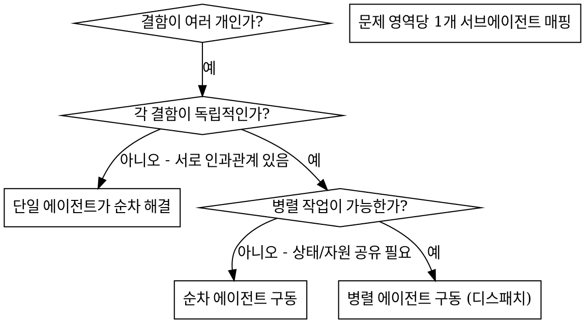

# 🤖 병렬 서브에이전트 조율 규칙 (dispatching-parallel-agents)

본 스킬은 격리된 컨텍스트를 지닌 서브에이전트에게 작업을 안전하게 위임하고, 병렬로 연산을 수행하게 한 뒤 최종적으로 메인 세션으로 수렴 및 검수하기 위한 규칙입니다.

독립된 여러 결함이 동시다발적으로 존재할 때(예: 다른 테스트 파일 오류, 각기 다른 서브시스템 버그 등) 이를 하나씩 순차적으로 고치는 것은 비효율적입니다. 각 결함은 병렬로 안전하게 분석 및 픽스될 수 있습니다.

**핵심 원칙:** 독립된 문제 도메인별로 서브에이전트를 1개씩 할당하여 동시에 병렬로 작업을 가동합니다.

## 📋 언제 사용하는가?

### 적용 대상 (Use):
- 서로 다른 원인을 가진 3개 이상의 테스트 파일이 실패할 때
- 여러 독립된 서브시스템에서 각각 버그가 감지되었을 때
- 각 결함 해결에 서로의 세부 맥락 지식이 불필요할 때
- 작업 간에 수정할 공유 자원이나 파일이 겹치지 않을 때

### 적용 비대상 (Don't Use):
- 결함들이 연쇄적인 경우 (하나를 고치면 다른 것들도 자동으로 해결될 여지가 있을 때)
- 시스템 전체의 통합 구조를 먼저 깊게 이해해야 할 때
- 수정할 소스 파일이 겹쳐 에이전트 간 코드 충돌이 일어날 때

## ⚙️ 조율 프로세스

### 1. 독립 문제 도메인 식별
- 결함별 영역 구분:
  * 도메인 A: 사용자 권한 조회 에러
  * 도메인 B: 파일 업로드 제한 에러
  * 도메인 C: 데이터 필터 오작동

### 2. 서브에이전트 태스크 지시서 구체화
각 서브에이전트 프롬프트에는 다음이 포함되어야 합니다:
- **명확한 작업 범위**: 수정할 단일 파일이나 단일 기능 컴포넌트 명시
- **성공 목표**: 해당 테스트가 통과하거나 버그가 완치될 것
- **제약 조건**: 범위 밖의 인접 소스코드를 무단 수정하지 말 것
- **기대 산출물**: 무엇이 문제였고 어떻게 고쳤는지 요약 보고서 제출

### 3. 병렬 디스패치 및 비동기 대기
- 여러 개의 독립 서브에이전트 태스크를 동시에 백그라운드로 작동시킵니다.

### 4. 리뷰 및 병합 (Integration)
- 서브에이전트들이 돌아오면:
  1. 각 에이전트의 요약 보고서를 정독합니다.
  2. 수정된 파일들이 겹치지 않고 정합성을 유지하는지 확인합니다.
  3. 전체 빌드 및 테스트를 구동하여 최종 검증합니다.
  4. 메인 브랜치(또는 워킹 트리)에 병합합니다.
