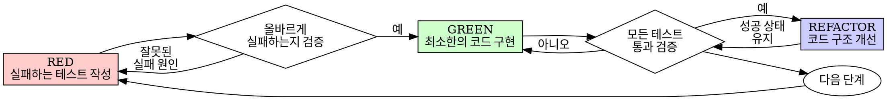

# 테스트 주도 개발 (Test-Driven Development, TDD)

## 개요 (Overview)

테스트를 먼저 작성합니다. 테스트가 실패하는 것을 관찰합니다. 테스트를 통과하기 위한 최소한의 코드만 작성합니다.

**핵심 원칙:** 테스트가 실패하는 것을 직접 보지 않았다면, 해당 테스트가 올바른 대상을 검증하고 있는지 신뢰할 수 없습니다.

**규칙의 문구(형식)만 따르고 본래 의도(정신)를 위배하는 것은 결국 규칙 전체를 위배하는 것과 같습니다.**

## 적용 시점 (When to Use)

**항상 적용:**
- 새로운 기능 구현 시
- 버그 수정 시
- 리팩토링 작업 시
- 동작 방식 변경 시

**예외 사항 (반드시 사용자의 명시적 동의 필요):**
- 일회성 프로토타입 작성 시
- 자동 생성되는 코드
- 단순 설정 파일

"이번 한 번만 TDD를 생략할까?"라는 생각이 든다면 즉시 멈추십시오. 그것은 자기합리화일 뿐입니다.

## 철칙 (The Iron Law)

```
실패하는 테스트를 먼저 작성하기 전에는 프로덕션 코드를 단 한 줄도 작성하지 않는다.
```

테스트를 작성하기 전에 코드를 먼저 작성하셨습니까? 그렇다면 즉시 지우고 처음부터 다시 시작하십시오.

**예외 없음:**
- "참고용"으로 보존하지 마십시오.
- 테스트를 작성하면서 슬그머니 "수정해서 재사용"하지 마십시오.
- 쳐다보지도 마십시오.
- 삭제는 완전한 삭제를 의미합니다.

테스트를 바탕으로 완전히 새로 구현해야 합니다.

## 적-청-리팩터 (Red-Green-Refactor)



### RED - 실패하는 테스트 작성

어떤 동작이 일어나야 하는지 보여주는 가장 단순한 테스트를 하나 작성합니다.

<올바른 예시>
```typescript
test('실패한 작업을 3회 재시도한다', async () => {
  let attempts = 0;
  const operation = () => {
    attempts++;
    if (attempts < 3) throw new Error('fail');
    return 'success';
  };

  const result = await retryOperation(operation);

  expect(result).toBe('success');
  expect(attempts).toBe(3);
});
```
명확한 이름, 실제 동작 검증, 단일 목적 수행
</올바른 예시>

<잘못된 예시>
```typescript
test('재시도가 동작함', async () => {
  const mock = jest.fn()
    .mockRejectedValueOnce(new Error())
    .mockRejectedValueOnce(new Error())
    .mockResolvedValueOnce('success');
  await retryOperation(mock);
  expect(mock).toHaveBeenCalledTimes(3);
});
```
모호한 이름, 실제 코드가 아닌 모의 객체(mock)의 반응을 검증함
</잘못된 예시>

**테스트 요구사항:**
- 단일 동작만 검증
- 명확한 테스트 이름 작성
- 실제 코드 테스트 (불가피한 경우를 제외하고 모의 객체 자제)

### RED 검증 - 실패 여부 확인

**필수 단계이며 절대 건너뛰지 마십시오.**

```bash
npm test path/to/test.test.ts
```

확인 사항:
- 테스트가 실제로 실패하는가 (컴파일 에러가 아닌 테스트 단언 실패여야 함)
- 실패 메시지가 예상과 일치하는가
- 오타가 아니라 기능이 구현되지 않아 실패하는 것이 맞는지 확인

**테스트가 곧바로 통과합니까?** 이미 구현되어 있는 동작을 테스트하고 있는 것입니다. 테스트를 수정하십시오.

**테스트 코드 자체에 오류(Error)가 있습니까?** 에러를 해결하고 올바르게 실패할 때까지 재실행하십시오.

### GREEN - 최소한의 코드 구현

테스트를 통과하기 위한 가장 단순한 코드를 작성합니다.

<올바른 예시>
```typescript
async function retryOperation<T>(fn: () => Promise<T>): Promise<T> {
  for (let i = 0; i < 3; i++) {
    try {
      return await fn();
    } catch (e) {
      if (i === 2) throw e;
    }
  }
  throw new Error('unreachable');
}
```
통과하기에 딱 충분한 구현
</올바른 예시>

<잘못된 예시>
```typescript
async function retryOperation<T>(
  fn: () => Promise<T>,
  options?: {
    maxRetries?: number;
    backoff?: 'linear' | 'exponential';
    onRetry?: (attempt: number) => void;
  }
): Promise<T> {
  // 과설계 (YAGNI - You Aren't Gonna Need It)
}
```
필요 이상으로 복잡한 과설계
</잘못된 예시>

테스트 범위를 넘어서는 부가 기능을 추가하거나, 성급하게 다른 코드를 리팩토링하거나, 필요 이상의 최적화를 수행하지 마십시오.

### GREEN 검증 - 성공 확인

**필수 단계입니다.**

```bash
npm test path/to/test.test.ts
```

확인 사항:
- 작성한 테스트가 통과하는가
- 기존의 다른 테스트들도 여전히 통과하는가
- 경고(warning)나 불필요한 에러 로그 없이 깔끔하게 통과하는가

**테스트가 실패합니까?** 테스트 코드가 아닌 프로덕션 코드를 수정하십시오.

**기타 테스트가 깨집니까?** 즉시 수정하십시오.

### REFACTOR - 코드 구조 개선

테스트가 녹색(성공)으로 바뀐 후에만 진행합니다:
- 중복 코드 제거
- 변수 및 함수 이름 개선
- 복잡한 로직을 헬퍼 함수로 추출

성공 상태를 계속 유지해야 하며, 이 단계에서 새로운 기능을 추가해서는 안 됩니다.

### 반복 (Repeat)

다음 기능을 위해 새로운 실패하는 테스트를 작성합니다.

## 올바른 테스트의 기준 (Good Tests)

| 특성 | 올바른 예 | 잘못된 예 |
|---------|------|-----|
| **단일성 (Minimal)** | 하나의 목적만 가짐. 이름에 "and"가 들어간다면 분리하십시오. | `test('이메일과 도메인 및 공백을 검증한다')` |
| **명확성 (Clear)** | 이름이 구체적인 동작을 묘사함 | `test('테스트1')` |
| **의도 노출 (Shows intent)** | 사용하고자 하는 이상적인 API 형태를 보여줌 | 코드가 무엇을 수행하는지 파악하기 어려움 |

## 절차가 중요한 이유 (Why Order Matters)

**"코드를 먼저 짜고 나중에 검증용 테스트를 만들겠습니다"**

구현 후에 작성한 테스트는 즉시 성공(Pass)해 버립니다. 이는 아무것도 증명하지 못합니다:
- 엉뚱한 대상을 테스트하고 있을 수 있습니다.
- 사양(behavior)이 아닌 특정 구현 방식(implementation)을 검증하는 테스트가 되기 쉽습니다.
- 미처 생각지 못한 예외 상황(edge case)을 놓칠 확률이 높습니다.
- 버그를 실제로 잡아낼 수 있는지 여부를 검증할 기회가 없습니다.

테스트를 먼저 작성해야만 실패하는 것을 직접 보며 테스트 코드의 실효성을 증증할 수 있습니다.

**"이미 수동으로 모든 예외 케이스를 확인했습니다"**

수동 테스트는 일회성입니다.
- 테스트한 내역이 기록에 남지 않습니다.
- 코드가 바뀔 때마다 매번 똑같이 재실행하기 어렵습니다.
- 릴리스 압박이 오면 세부 케이스를 빠뜨리기 쉽습니다.
- "내가 해봤을 땐 잘 됐다"는 종합적인 품질 보증이 될 수 없습니다.

자동화된 테스트는 체계적이며, 코드가 바뀔 때마다 동일하게 반복 실행됩니다.

**"몇 시간 동안 짠 코드를 지우는 것은 시간 낭비입니다"**

매몰 비용 오류(Sunk Cost Fallacy)입니다. 지나간 시간은 되돌릴 수 없습니다. 지금 선택지는 두 가지입니다:
- 코드를 과감히 지우고 TDD로 신뢰도 높게 다시 작성한다. (확실한 신뢰도 확보)
- 그대로 두고 테스트만 끼워 맞춘다. (낮은 신뢰도, 잠재적 버그 온상)

진짜 낭비는 신뢰할 수 없는 코드를 보존하는 것입니다. 제대로 검증되지 않은 작동 코드는 기술 부채에 불과합니다.

**"TDD는 너무 교조적입니다. 실용적으로 절충해야 합니다"**

TDD야말로 가장 실용적입니다:
- 커밋 전에 버그를 찾아줍니다. (나중에 디버깅하는 것보다 빠름)
- 회귀 버그(Regression)를 완벽히 막아줍니다.
- 테스트 코드가 그 자체로 훌륭한 API 문서 역할을 합니다.
- 심리적 안전감을 주어 코드 구조를 자유롭게 리팩토링할 수 있게 합니다.

"실용적 절충"이라며 단계를 건너뛰면, 결국 운영 환경에서 버그를 찾느라 더 많은 시간을 낭비하게 됩니다.

**"나중에 테스트를 짜도 의도만 통하고 똑같지 않나요?"**

아닙니다. 사후 테스트는 "이 코드가 어떻게 도는가?"를 묻고, 사전 테스트는 "이 코드가 어떻게 돌아야 하는가?"를 묻습니다.
사후 테스트는 이미 작성된 코드의 영향(편향)을 받습니다. 요구 사양이 아닌 구현된 내용 위주로만 테스트를 짜게 되고, 미처 생각지 못한 예외 상황을 설계 단계에서 잡아낼 기회를 잃게 됩니다.

## 흔한 합리화와 실상 (Common Rationalizations)

| 변명 | 실상 |
|--------|---------|
| "너무 단순한 코드라 테스트가 필요 없다" | 단순한 코드도 깨집니다. 테스트 작성은 30초면 충분합니다. |
| "나중에 테스트를 짜겠다" | 바로 성공하는 테스트는 유효성을 검증할 수 없습니다. |
| "사후 테스트나 사전 테스트나 똑같다" | 사후 테스트는 편향에 갇힙니다. 사전 테스트만이 올바른 설계를 이끕니다. |
| "이미 수동으로 다 확인해 봤다" | 수동 테스트는 재실행이 어렵고 기록에 남지 않습니다. |
| "열심히 짠 코드를 지우는 건 아깝다" | 검증되지 않은 코드를 유지하는 것이 더 큰 부채입니다. |
| "일단 코드는 두고 테스트부터 돌려보겠다" | 기존 코드를 보며 맞추는 것도 사후 테스트입니다. 삭제 후 시작하십시오. |
| "우선 탐색 및 스파이크 코딩이 필요하다" | 탐색 후 탐색 코드를 과감히 폐기하고 TDD로 다시 작성하십시오. |
| "테스트 짜기가 너무 까다롭다" | 설계가 명확하지 않거나 코드가 결합도가 높다는 경고입니다. 설계를 단순화하십시오. |
| "TDD를 하면 개발 속도가 느려진다" | 디버깅 시간을 획기적으로 줄여주므로 장기적으로 훨씬 빠릅니다. |

## 위험 신호 (Red Flags) - 즉시 코드를 지우고 다시 시작하십시오

- 테스트보다 구현 코드가 먼저 작성됨
- 구현 완료 후 테스트를 덧붙임
- 테스트가 작성하자마자 바로 통과함
- 테스트가 왜 실패했는지 논리적으로 설명하지 못함
- "이번 한 번만 예외로 하자"며 단계를 건너뜀
- "내가 수동으로 다 확인했으니 괜찮다"고 합리화함
- "보존용으로 놔두고 참고하겠다"며 이전 코드를 남겨둠

**이 중 하나라도 해당된다면: 프로덕션 코드를 완전히 지우고 TDD로 처음부터 다시 시작하십시오.**

## 예제: 버그 수정 과정

**Bug:** Empty email accepted

**RED**
```typescript
test('빈 이메일 주소는 거부한다', async () => {
  const result = await submitForm({ email: '' });
  expect(result.error).toBe('Email required');
});
```

**Verify RED**
```bash
$ npm test
FAIL: expected 'Email required', got undefined
```

**GREEN**
```typescript
function submitForm(data: FormData) {
  if (!data.email?.trim()) {
    return { error: 'Email required' };
  }
  // ...
}
```

**Verify GREEN**
```bash
$ npm test
PASS
```

**REFACTOR**
여러 필드의 유효성 검사 로직을 공통 validation 헬퍼로 깔끔하게 정제합니다.

## 최종 검증 체크리스트

작업을 완료하기 전에 다음 사항을 모두 만족하는지 점검하십시오:

- [ ] 새로 추가된 모든 함수와 메서드에 테스트가 존재하는가
- [ ] 코드를 작성하기 전에 테스트가 먼저 실패하는 것을 관찰했는가
- [ ] 각 테스트가 오타가 아닌 예상한 논리적 사유로 올바르게 실패했는가
- [ ] 테스트를 통과하기 위한 최소한의 코드만 작성했는가
- [ ] 작성한 모든 테스트와 기존 테스트가 완벽히 통과하는가
- [ ] 경고나 예외 로그 없이 깨끗하게 통과하는가
- [ ] 모의 객체(mock)의 남용 없이 실제 객체를 위주로 테스트했는가
- [ ] 예외 케이스 및 에러 핸들러 부분도 테스트로 커버했는가

위 항목 중 하나라도 체크할 수 없다면 TDD를 건너뛴 것입니다. 코드를 지우고 다시 시작하십시오.

## 문제 해결 가이드

| 상황 | 해결책 |
|---------|----------|
| 어떻게 테스트를 짜야 할지 막막할 때 | 내가 원하는 가장 이상적인 형태의 API 사용법을 먼저 작성해 보십시오. |
| 테스트 작성 자체가 너무 복잡할 때 | 설계가 너무 복잡하다는 뜻입니다. 인터페이스를 더 단순화하십시오. |
| 모든 것을 다 모킹(mocking)해야 할 때 | 결합도가 너무 높습니다. 의존성 주입(Dependency Injection)을 적용하십시오. |
| 테스트 셋업 과정이 너무 무거울 때 | 공통 셋업을 헬퍼 함수로 추출하고, 설계 자체를 더 작고 독립적으로 쪼개십시오. |

## 최종 규칙

```
동작하는 프로덕션 코드가 있으려면 반드시 그보다 먼저 작성되어 실패했던 테스트가 존재해야 한다.
그렇지 않다면 그것은 TDD가 아니다.
```

사용자의 허락 없이는 어떠한 예외도 허용되지 않습니다.
