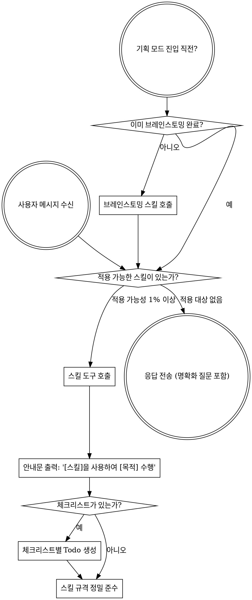

<SUBAGENT-STOP>
특정 작업을 실행하기 위해 서브에이전트로 파견된 경우, 이 스킬을 건너뒤십시오.
</SUBAGENT-STOP>

<EXTREMELY-IMPORTANT>
수행 중인 작업에 특정 스킬이 적용될 가능성이 1%라도 있다고 판단되면, 해당 스킬을 반드시 호출해야 합니다.

수행 중인 작업에 특정 스킬이 적용되는 경우, 선택의 여지가 없습니다. 무조건 사용해야 합니다.

이 규칙은 타협 불가하며 선택 사항이 아닙니다. 어떤 변명도 허용되지 않습니다.
</EXTREMELY-IMPORTANT>

## 지침 우선순위

스킬은 시스템 기본 지침보다 우선하지만, **사용자의 명시적 지시가 항상 최우선권**을 가집니다:

1. **사용자의 명시적 지시** (CLAUDE.md, GEMINI.md, AGENTS.md, 직접적인 지시) — 최상위 우선순위
2. **프로젝트 스킬** — 충돌 시 시스템 기본 동작보다 우선함
3. **시스템 기본 지침** — 최하위 우선순위

예를 들어, 워크스페이스 규칙인 GEMINI.md가 "TDD를 사용하지 말라"고 지시하고, 특정 스킬이 "항상 TDD를 사용하라"고 규정하는 경우, 사용자의 지시(GEMINI.md)를 따릅니다. 사용자가 제어권을 쥐고 있습니다.

## 스킬 접근 방법

- **Claude Code 환경**: `Skill` 도구를 사용합니다. 스킬을 호출하면 해당 내용이 로드되어 제공되며, 이를 직접 따릅니다. 스킬 파일에 `Read` 도구를 사용해서는 안 됩니다.
- **Gemini CLI 및 Antigravity IDE 환경**: `activate_skill` 또는 관련 MCP 도구를 통해 활성화합니다. IDE 환경은 세션 시작 시 스킬 메타데이터를 로드하고 필요에 따라 전체 본문을 활성화합니다.

---

# 스킬 활용 요령

## 기본 원칙

**모든 응답 또는 실행을 개시하기 전에 관련된 스킬을 먼저 호출합니다.** 스킬이 적용될 확률이 1%라도 있다면 호출하여 검증해야 합니다. 만약 호출한 스킬이 현재 상황에 맞지 않는 것으로 판단되면 사용하지 않아도 무방합니다.

## 주의해야 할 자기합리화 (Red Flags)

다음과 같은 생각이 머릿속에 스친다면 즉시 행동을 멈추십시오. 이는 규칙 회피의 징후입니다:

| 머릿속 생각 | 실제 팩트 |
|---|---|
| "이건 아주 단순한 질문이야" | 질문 역시 태스크입니다. 관련 스킬이 있는지 확인하십시오. |
| "컨텍스트를 먼저 파악해야겠어" | 스킬 확인은 명확화 질문보다 무조건 선행되어야 합니다. |
| "코드베이스를 먼저 둘러보고 올게" | 스킬 문서가 코드 탐색 방법(SOP)을 안내합니다. 먼저 체크하십시오. |
| "Git 상태나 파일을 빠르게 조회할게" | 파일 단순 조회만으로는 맥락을 잃을 수 있습니다. 스킬을 먼저 확인하십시오. |
| "일단 정보를 수집하는 게 먼저야" | 스킬이 정보를 수집하는 정석 절차를 제시합니다. |
| "이건 굳이 정식 스킬을 쓸 필요 없어" | 스킬이 존재한다면 무조건 사용해야 합니다. |
| "이미 이 스킬의 내용을 외우고 있어" | 스킬은 지속적으로 개선됩니다. 현재 최신 본문을 다시 읽으십시오. |
| "이건 실제 작업(Task)에 안 들어가" | 에이전트의 모든 행동은 작업입니다. 스킬 유무를 체크하십시오. |
| "이 스킬을 쓰기엔 배보다 배꼽이 더 커" | 단순한 작업이 복잡한 장애로 이어집니다. 규격을 준수하십시오. |
| "이거 하나만 먼저 가볍게 처리할게" | 무언가를 수행하기 전에 무조건 스킬부터 로드하십시오. |

## 스킬 우선순위

여러 스킬이 동시에 적용될 수 있는 경우, 다음 순서에 따릅니다:

1. **프로세스 제어 스킬** (브레인스토밍, 디버깅 등) - 태스크에 접근하는 방식(HOW)을 결정합니다.
2. **구현 도메인 스킬** (프론트엔드 디자인 등) - 구체적인 작업 실행을 가이드합니다.

- 예: "X 기능을 구현해줘" ➡️ 브레인스토밍 스킬 1순위 구동 ➡️ 구현 도메인 스킬 연동.
- 예: "이 버그 고쳐줘" ➡️ 디버깅 스킬 1순위 구동 ➡️ 도메인 스킬 연동.

## 스킬 유형
- **엄격형 (Rigid)** (TDD, 디버깅 등): 타협 없이 지침을 있는 그대로 정밀히 따릅니다. 임의로 단순화하지 마십시오.
- **유연형 (Flexible)** (패턴 등): 주어진 핵심 원칙을 현재 컨텍스트에 알맞게 적용합니다.
