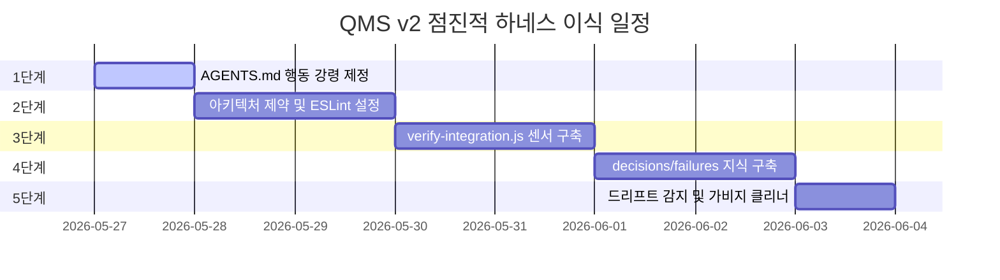

# QMS v2 5단계 점진적 하네스 이식 기획안 (R0)

본 기획안은 차장님의 지시에 따라, 하네스 엔지니어링의 핵심 4대 구성요소(지시문서, 아키텍처제약, 피드백루프, 지식저장소) 및 가비지 컬렉션을 한 번에 무리하게 구축하지 않고, **영향도를 최소화하면서 한 단계씩 안전하게 살을 붙여 나가는 5단계 점진적 이식 로드맵**입니다.

* **최초 작성일:** 2026-05-27  
* **문서 버전:** R0  
* **보관 경로:** `안티그래비티/plan/2026-05-27_QMS_v2_점진적_하네스_이식_기획안_R0.md`

---

## 📅 세분화된 5단계 이식 로드맵 요약



---

## User Review Required

Document anything that requires user review or feedback, for example, breaking changes or significant design decisions. Use GitHub alerts (IMPORTANT/WARNING/CAUTION) to highlight critical items.

> [!IMPORTANT]
> **1. 점진적 이식 및 결재 방식**
> 각 단계를 한 번에 병합하지 않고, 차장님께 **매 단계가 끝날 때마다 개별 Walkthrough를 보고하고 승인을 얻은 후** 다음 단계로 진입하겠습니다. 
> 
> **2. 영향도 최소화**
> 모든 이식 작업은 기존 Vite 개발 서버 및 Supabase 실서버 런타임에 아무런 영향을 주지 않는 순수 독립적 '안전망 파일' 형태로 구성됩니다.

---

## Proposed Changes (단계별 상세 작업 계획)

### 1단계: [지시 문서] 에이전트 전용 행동 강령의 정초 (`AGENTS.md` 제정)
* **목표:** 에이전트가 QMS 프로젝트에 진입했을 때 읽어야 하는 최초의 규범적 나침반을 확립합니다.
* **작업 상세:**
  #### [NEW] [AGENTS.md](file:///c:/Users/mjjeon/Desktop/QMS%20프로젝트/shinwoo-valve-qms/AGENTS.md)
  - QMS v2의 핵심 스택(React, Tailwind, Supabase) 코딩 컨벤션 및 폴더 구조 규정.
  - 당사의 **3단계 결재 프로세스([[history/2026-04-10_v0_23_0_[P12]_DNAS(개발자_노트_자동화_및_승인_시스템)_이식|DNAS]])** 및 **배포 전 3단 검증 안전망**을 에이전트 전용의 강제적 금지/준수 규칙으로 명문화.
  - print/console 출력 금지 및 특정 DB 다이렉트 쿼리 통제 등 에이전트 행동 지침 선언.

---

### 2단계: [아키텍처 제약] 모듈 경계 린트 설정 및 규칙 강제
* **목표:** 규정을 깜빡 잊은 에이전트가 코드를 쓰더라도 구조적으로 실수를 커밋하지 못하도록 제약의 가이드레일을 세웁니다.
* **작업 상세:**
  #### [MODIFY] [.eslintrc.cjs](file:///c:/Users/mjjeon/Desktop/QMS%20프로젝트/shinwoo-valve-qms/.eslintrc.cjs)
  - 프론트(React components/hooks)가 백엔드 API/DB 모듈을 직접 참조(import)하지 않고 반드시 정해진 커넥터나 훅 레이어를 경유하도록 의존성 제약 룰 추가.
  - 커밋 전 스타일 및 규칙을 자동 포맷하는 pre-commit 룰 연동 구조의 기술적 기틀 마련.

---

### 3단계: [피드백 루프] 통합 정합성 검증 센서 (`verify-integration.js`) 구축
* **목표:** API의 데이터 형태와 프론트 Hook의 바인딩 데이터 간 불일치(Boundary Mismatch)를 실시간 감지하여 에이전트의 실수를 즉각 피드백 고쳐잡습니다.
* **작업 상세:**
  #### [NEW] [verify-integration.js](file:///c:/Users/mjjeon/Desktop/QMS%20프로젝트/shinwoo-valve-qms/.agent/skills/qms-orchestrator/scripts/verify-integration.js)
  - `src/` 폴더 내 API 엔드포인트의 리턴 데이터 키값과 프론트엔드의 `fetchJson` 제네릭 형식을 정적 파싱 대조.
  - camelCase ↔ snake_case 누락이나 철자 오차가 있을 경우, 구체적인 예외 로그(Sensor)를 뿜어내며 빌드 전 자가 수정을 유도하는 Node.js 기반 경량 검사기 구축.

---

### 4단계: [지식 저장소] 누적 기억 디렉토리 (`docs/`) 개설 및 이력 적재
* **목표:** 세션마다 백지로 시작하는 에이전트에게 과거의 의사결정과 실패 이력을 제공해 엉뚱한 삽질을 영구 차단합니다.
* **작업 상세:**
  - `docs/decisions/` (ADR), `docs/conventions/` (명명법), `docs/failures/` (과거 오류 극복기) 디렉토리 구조 신설.
  #### [NEW] [001-caching.md](file:///c:/Users/mjjeon/Desktop/QMS%20프로젝트/shinwoo-valve-qms/docs/decisions/001-caching.md)
  - 세션 데이터 캐싱에 관한 기술 결정 문서.
  #### [NEW] [001-celery-failure.md](file:///c:/Users/mjjeon/Desktop/QMS%20프로젝트/shinwoo-valve-qms/docs/failures/001-celery-failure.md)
  - 비동기 처리 도입 실패 원인 분석 및 대안을 명시한 실패 기록 문서.

---

### 5단계: [가비지 컬렉션] 구조 드리프트 및 오염 파일 클리너 탑재
* **목표:** 에이전트가 충동적으로 생성하고 방치한 임시/백업 파일로 코드베이스가 썩는 것을 자동 면역 방어합니다.
* **작업 상세:**
  #### [NEW] [check-structure.js](file:///c:/Users/mjjeon/Desktop/QMS%20프로젝트/shinwoo-valve-qms/.agent/skills/qms-orchestrator/scripts/check-structure.js)
  - 루트나 `src/`에 `temp_*`, `*_new`, `*_old`, `*_backup` 과 같은 드리프트 오염 파일이 감지될 시 자동으로 청소하거나 강제 경고를 뿜어내는 가비지 컬렉션 자동화 모듈 탑재.

---

## 🧪 Verification Plan

각 단계가 완료될 때마다 아래와 같이 개별적으로 철저히 검증을 거치겠습니다.

### Automated Tests
* **1단계 완료 시:** `AGENTS.md`에 정의된 문장 구조가 맑게 파싱되는지 검사.
* **2단계 완료 시:** ESLint 룰을 수동 실행하여 임포트 경계 제약이 정상 트리거되는지 검증:
  ```powershell
  npm run lint
  ```
* **3단계 완료 시:** `verify-integration.js`를 가동하여 기존 QMS v2의 API-UI 연결 정합성 보고서가 올바르게 도출되는지 확인:
  ```powershell
  node .agent/skills/qms-orchestrator/scripts/verify-integration.js
  ```
* **5단계 완료 시:** 가비지 클리너 스크립트를 가동하여 강제로 심어둔 임시 백업 파일(`src/temp_fix.ts`)을 정확하게 포착하고 소거하는지 검증.

### Manual Verification
* 매 단계 구축이 완료될 때마다, 차장님께 코드 차이(Diff)와 테스트 결과 스크린샷을 Walkthrough 아티팩트로 정직하게 제출하고 사전 승인을 득하겠습니다.
