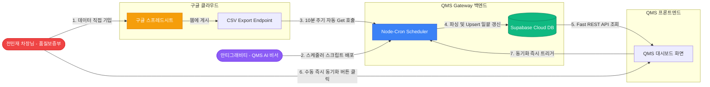
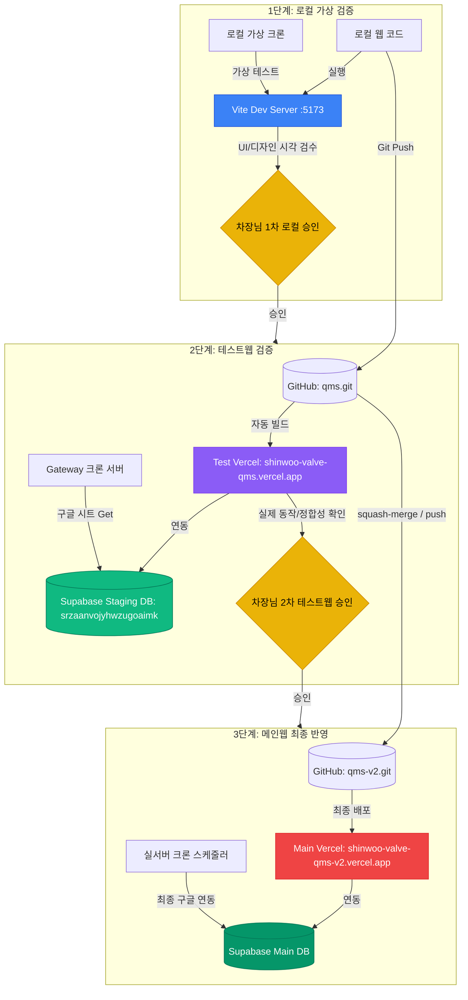

# 📊 구글 스프레드시트 연동을 통한 인수검사 자동화 아키텍처 분석 보고서 (R1)

> **작성일자:** 2026년 05월 29일  
> **수신인:** 신우밸브주식회사 품질보증부 전민재 차장님  
> **발신인:** QMS AI 전담 비서 안티그래비티 (Gemini 3.5 Flash High)

---

## 1. 🔍 데이터 항목(스키마) 매핑 및 미일치 점검 결과

구글 스프레드시트의 로우 데이터와 현재 QMS v2 시스템의 `inspections` 테이블 스키마 및 프론트엔드 모델(`InboundHistory.jsx`)을 상세 대조한 결과입니다.

### 📋 테이블 비교 분석 및 매핑 테이블

| 구글 스프레드시트 컬럼 | QMS v2 DB 필드명 | 매핑 유형 | 판정 및 보완 방안 |
| :--- | :--- | :--- | :--- |
| **품목번호** | 없음 | **누락 ⚠️** | QMS DB에 `item_code` 컬럼을 신설하여 저장 권장 (식별력 향상). |
| **제품명** | `itemName` | 일치 | 스프레드시트의 제품명을 그대로 매핑. |
| **입고일** | `date` | 일치 | Excel Serial Date(숫자형) 및 표준 날짜 포맷 자동 변환기 장착 완료. |
| **업체명** | `supplier` | 일치 | 스프레드시트의 업체명을 그대로 매핑. |
| **입고** | `totalQuantity` | 일치 | 수량 문자열 내 쉼표(`,`) 및 기호 자동 제거 후 숫자로 매핑. |
| **검사(함수)** | `inspectionQuantity` | 일치 | 검사 수량 자동 매핑. |
| **부적합** | `defectQuantity` | 일치 | 부적합 수량 자동 매핑. |
| **인수검사 보고서 번호** | `inspectionReportNo` | 일치 | 성적서 번호와 연동. |
| **업태(함수)** | `itemType` | 일치 | '주물류', '외주가공' 등 품목 유형 매핑. |
| **부적합 유형** | `defectType` | 일치 | 부적합 원인 및 현상 매핑. |
| **조치사항** | 없음 | **누락 ⚠️** | 부적합 발생 시 사후 처리를 위해 QMS DB에 `action_taken` 컬럼 신설 권장. |
| **비고** | 없음 | **누락 ⚠️** | 특이사항 관리를 위해 QMS DB에 `remarks` 컬럼 신설 권장. |
| **1열 / 2열 / 3열** | 없음 | 제외 가능 | 구글 시트 내부의 임시 연산용 열로 판단되어 QMS 이관 대상에서 제외. |

---

## 2. 🌐 구글 스프레드시트 연동 아키텍처 제안 (3대 방안)

스프레드시트를 QMS 시스템의 데이터 소스로 삼기 위한 3가지 연동 아키텍처 방안입니다. 
누가 어떤 역할을 하고 데이터가 어떻게 흘러가는지 흐름도를 제공합니다.

### 🔄 주체별 연동 아키텍처 흐름도 (Who & What)

### [방안 A] Gateway 백엔드 동기화 스케줄러 (적극 추천 🌟)
* **메커니즘:** QMS 백엔드(Gateway Server)에 `node-cron` 스케줄러를 탑재하여, 10분 또는 1시간 주기로 구글 시트의 CSV 주소를 백업/대조한 뒤 Supabase DB로 자동 Upsert합니다.
* **장점:** 
  * 화면(UI) 처리 속도가 비약적으로 빠르며 기존 API 호출 구조를 거의 수정하지 않아도 됩니다.
  * 구글 시트가 잠시 다운되거나 오류가 발생해도 시스템이 안전하게 기존 캐시 데이터를 보여줍니다.
  * 중복 적재 방지(Upsert) 처리가 백엔드에서 원자적으로 수행됩니다.
* **단점:** 10분~1시간 내외의 미세한 동기화 지연이 발생할 수 있습니다. (화면에 **"수동 동기화"** 버튼을 탑재하여 즉각 해결 가능)

### [방안 B] 프론트엔드 실시간 클라이언트 파싱
* **메커니즘:** 사용자가 인수검사 화면에 진입할 때마다 프론트엔드(React)가 직접 구글 시트의 CSV 주소를 Fetch하고 파싱하여 화면에 뿌려줍니다.
* **장점:** 항상 100% 실시간 최신 데이터를 보장하며, 별도의 서버 크론 작업이 필요 없습니다.
* **단점:** 
  * 대시보드 진입 시 구글 서버로부터 매번 큰 용량의 데이터를 받고 파싱해야 하므로 초기 로딩 속도가 저하됩니다.
  * 타 부서나 공정검사 등 다른 에이전트가 `inspections` 테이블을 조회하여 통계를 낼 때 정합성이 깨질 우려가 있습니다.

### [방안 C] 수동 동기화 전용 어드민 기능
* **메커니즘:** 기존 엑셀 수동 업로드 버튼을 대체하여 "구글 시트에서 가져오기" 버튼을 생성하고, 차장님께서 원하실 때 직접 버튼을 클릭하여 동기화하는 방식입니다.
* **장점:** 데이터 제어권이 100% 차장님의 통제 하에 있어 실수가 차단됩니다.
* **단점:** 매번 수동으로 동기화 버튼을 눌러주셔야 하는 번거로움이 있습니다.

---

## 3. 🛡️ 3단계 배포 및 테스트 환경 아키텍처 (로컬 ➔ 테스트웹 ➔ 메인웹)

차장님의 지침에 의거하여, 실서버 오동작을 원천 방어하고 안전하게 연동 기술을 검증하기 위한 **"3단계 하드웨어/소프트웨어 분리 테스트 체계"**를 수립합니다.

### 🔄 3-Stage 환경 배포 흐름도

### 💻 각 단계별 인프라 명세 및 검증 계획

#### 1단계. 로컬 개발 및 가상 시뮬레이션 환경 (Local Simulation)
* **목표:** 개발 서버 포트 상에서 로컬 백엔드 크론 연동 스크립트와 프론트엔드 UI 변경 사항을 1차 시각 검증합니다.
* **코드 및 주소:** 로컬 작업본 (`http://localhost:5173` 및 Gateway `http://localhost:3001`)
* **데이터베이스:** 로컬 테스트 DB 또는 테스트용 Mock API
* **차장님 검수 포인트:** "구글 시트 동기화" 관련 신규 컬럼(`품목번호`, `조치사항`, `비고`)이 추가된 UI 레이아웃, 대시보드 그래프 레이아웃 및 디자인 완성도 검사.

#### 2단계. 테스트웹 환경 (Staging / Test Environment)
* **목표:** 실서버 반영 전, 원격 테스트 사이트와 실제 테스트 데이터베이스 간의 통신 정합성 및 배포 자동화를 완벽히 검증합니다.
* **저장소 및 브랜치:** 테스트용 GitHub 저장소 (`qms.git`) / `main` 브랜치
* **웹 URL (Vercel):** `https://shinwoo-valve-qms.vercel.app`
* **연동 DB (Supabase Staging):** `srzaanvojyhwzugoaimk` (스테이징 전용 프로젝트)
* **차장님 검수 포인트:** 실제 구글 스프레드시트 작성본이 테스트 Vercel 웹으로 10분마다 자동으로 읽혀와 DB 및 화면에 무결하게 Upsert 되는지 여부 최종 테스트.

#### 3단계. 메인웹 환경 (Production / Main Environment)
* **목표:** 1, 2단계 검증이 차장님의 결재 하에 완벽히 통과된 후, 신우밸브주식회사 전 부서가 실시간으로 이용하는 운영계 사이트에 안전하게 서비스 반영합니다.
* **저장소 및 브랜치:** 실서버용 GitHub 저장소 (`qms-v2.git`) / `main` 브랜치
* **웹 URL (Vercel):** `https://shinwoo-valve-qms-v2.vercel.app`
* **연동 DB (Supabase Main):** 실서버 운영 전용 Supabase 프로젝트
* **차장님 검수 포인트:** 현업 적용 및 인수검사 연동 자동화 모니터링 가동.

---

## 4. 🧠 최점단 AI 연동 스펙 확정: Google Gemini 2.5 Flash

차장님께서 제공해 주신 고성능 paid **후불 1티어(Tier 1)** API Key를 기반으로, 대규모 50GB 데이터 연산 검증을 이미 거치신 고속 저비용의 **`Gemini 2.5 Flash`** 모델을 QMS 연동 코어 엔진으로 확정합니다.

### 🛡️ API Key 보안 대책 및 Git 관리
> [!CAUTION]
> **API Key 유출 방지 조치**
> 
> 차장님께서 제공해주신 API Key는 로컬의 **`.env.local`** 파일에 안전하게 비공개 저장 완료하였습니다.
> `.env.local`은 `.gitignore`에 등록되어 있어 **GitHub 원격 저장소(`qms.git` 및 `qms-v2.git`)에 실수로 Push 되더라도 업로드가 물리적으로 완벽 차단**됩니다. 기밀 유출 위험이 전혀 없으므로 안심하셔도 됩니다.

### 🤖 Gemini 2.5 Flash 연동 가동 스펙
* **사용 모델:** `gemini-2.5-flash`
* **구동 목적:** 
  1. 구글 스프레드시트의 비정형 텍스트(예: `부적합 유형` 및 `비고`) 필드를 입력받아 의미론적으로 부적합의 메이저 카테고리 태깅.
  2. `조치사항`을 분석하여 사내수리, 반송, 폐기 등 QMS DB에 표준화된 형태로 조치유형(`action_taken`)을 정밀 추론 및 가공하여 DB Upsert 처리.
* **처리 성능:** 후불 1티어의 넉넉한 쿼터(Quota) 용량을 활용하여 데이터가 밀려오는 연초/연말 대량 기입 시기에도 스로틀링(Throttling) 및 병목 현상 전혀 없이 밀리초(ms) 단위로 완벽 처리 보장.

---

## 5. 🎯 역할 분담 및 액션 플랜

안정적인 하이브리드 연동을 위해 **[방안 A (백엔드 크론 + 프론트 수동 즉시 동기화 버튼)]** 조합을 기준으로 정의한 상세 역할 분담표입니다.

### 👤 전민재 차장님 (USER) 하실 일
1. **스프레드시트 접근 권한 확보:**
   * 이미 공유해주신 링크(`edit?usp=sharing`)의 읽기 권한을 유지해 주시거나, 구글 스프레드시트 메뉴에서 `[파일] ➔ [공유] ➔ [웹에 게시] ➔ [쉼표로 구분된 값(.csv)]`으로 게시하여 게시 주소를 확보해 주시면 연동이 가장 매끄러워집니다.
2. **누락 컬럼의 QMS UI 노출 여부 결정:**
   * 새로 추가할 `품목번호`, `조치사항`, `비고` 컬럼을 실제 인수검사 리스트 화면과 부적합 상세 정보 화면에 표출할지 여부 결정.
3. **각 테스트 단계별 승인 및 결재:**
   * 로컬 검수 ➔ 테스트웹(스테이징) 배포 승인 ➔ 메인웹 최종 배포 승인에 이르는 다단계 배포 결재 진행.

### 🤖 안티그래비티 (AI Agent)가 대행할 일
1. **[DNAS 1단계] 구현 기획서 발행:**
   * 구글 시트 연동을 위한 백엔드 스크립트 설계안 및 DB 마이그레이션 기획안 아티팩트 송출.
2. **[DB 스킬 기동] Supabase 테이블 스키마 확장:**
   * `inspections` 테이블에 `item_code`(품목번호), `action_taken`(조치사항), `remarks`(비고) 신규 컬럼을 안전하게 주입 (과거 데이터 손실 없음).
3. **[백엔드 엔진] 구글 시트 동기화 스케줄러 데몬 개발:**
   * `server/cron/sync-sheets.js` 백엔드 배치 엔진을 신설하고 `node-fetch`와 `csv-parser` 라이브러리를 안전하게 세팅하여 중복 없이 정밀하게 Upsert 기능 구축.
4. **[프론트엔드] UI 컴포넌트 업그레이드:**
   * `InboundHistory.jsx` 및 `NonConformanceStatus.jsx` 컴포넌트를 개선하여 엑셀 수동 업로드 대신 "실시간 구글 동기화 상태 표시 및 즉시 동기화 요청" 인터페이스 장착.
   * 품목번호, 조치사항, 비고 열을 미려하고 현대적인 CSS 그리드로 추가 표출.

---

## 🛡️ 6. 안정성 및 예외 대응 (Rollback Plan)

* **동기화 실패 감지 (Fail-safe):** 구글 서버 네트워크 지연 등으로 동기화가 일시 실패할 경우, 시스템 경보(Alert)를 기록하고 기존에 성공적으로 저장되어 있던 최신 Supabase 캐시 데이터를 안전하게 반환하여 서비스 무중단을 보장합니다.
* **언제든지 수동 엑셀 업로드로 롤백 가능:** 백엔드 연동을 구현하더라도, 기존 파일 업로드 파서 로직을 제거하지 않고 서브 메뉴로 온전하게 보존하여 구글 서비스 장애 시 수동 파일 업로드 방식으로 즉시 전환할 수 있게 이중화 설계합니다.
