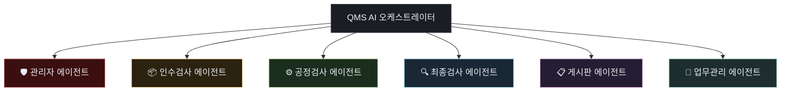

# 신우밸브주식회사 품질보증부 QMS AI 에이전트 구성안 및 기능 보고서 (R0)

- **작성일자:** 2026년 06월 01일
- **수신:** 품질보증부 전민재 차장 및 부서원 일동
- **발신:** 품질보증부 QMS AI 어시스턴트 (Antigravity)
- **문서 목적:** 신우밸브 QMS v2 프로젝트 내에 구축된 AI 에이전트들의 체계적인 구성안과 담당 역할 및 핵심 기능을 보고하여, 부서 내 AI 협업 시 업무 흐름을 직관적으로 파악할 수 있도록 돕습니다.

---

## 1. QMS AI 시스템 기본 아키텍처 및 안전 하네스 (Harness)

신우밸브 QMS v2 프로젝트는 시스템의 안정성과 데이터 보안을 최우선으로 사수하기 위해, 강력한 안전 장치인 **'하네스 행동 강령(GEMINI.md)'**을 바탕으로 구동됩니다. AI 에이전트들은 임의로 시스템이나 DB를 조작할 수 없으며, 반드시 부서의 승인 프로세스를 통과해야 합니다.

### 🛡️ 3단계 결재 프로세스 (DNAS)
모든 실질적인 기능 변경 및 스크립트 실행은 아래 단계를 순서대로 이행하며 단계를 절대 생략할 수 없습니다.
1. **1단계 Plan (기획안 승인 요청):** `implementation_plan.md`를 아티팩트로 발행하여 설계를 사전 결재받습니다.
2. **2단계 Task (작업 명세 송출):** 승인 후 `task.md`를 실시간 스냅샷으로 제공하며 세부 작업을 진행합니다.
3. **3단계 Execution & Walkthrough (최종 완료 보고):** 완료 후 `walkthrough.md`를 발행하여 최종 검증 보고를 수행합니다.

### 🔒 다단계 승인 배포 프로토콜 및 하드 락 (Hard Lock)
모든 원격 배포(`git push`)는 **[로컬웹 확인] ➔ [테스트웹 확인] ➔ [메인웹 확인]**의 3단계를 거치며, 전민재 차장님의 명시적 단계별 결재 승인을 획득하기 전에는 AI 단독으로 배포 명령을 실행할 수 없습니다.

---

## 2. 6대 부서 특화 서브 에이전트 구성안 및 기능

QMS v2 시스템은 품질보증부의 고유한 직무 도메인에 최적화된 **6개의 전담 AI 에이전트**로 세분화하여 협업을 진행합니다.

### 1) 🛡️ 관리자 에이전트 (Admin Agent)
- **자율도 레벨:** 1 (Read-only 권장, 최고 보안 영역)
- **담당 기능:**
  - QMS 사용자 계정 및 권한 관리 시스템 유지 보수
  - 회원 정보 보호를 위한 비밀번호 일방향 암호화 등 보안 로직 적용
  - 시스템 전역 설정 및 메인 화면 구성요소(헤더, 히어로 영역) 관리
- **수정 가능 DB 테이블:** `users`, `settings`
- **핵심 역할:** 시스템의 게이트웨이 역할을 담당하며, 보안 위험 요소를 사전에 통제합니다.

### 2) 📦 인수검사 에이전트 (Inbound Inspection Agent)
- **자율도 레벨:** 2 (Draft, 결재 후 개발 자율 수행)
- **담당 기능:**
  - 원자재 및 부품 반입 시 불량률 및 적합 여부를 측정하는 **인수검사 대시보드** 관리
  - 검사 결과 분석 및 부적합품 현황 모니터링 컴포넌트 개발
  - 품목 마스터(Item Master) 정보 기반의 데이터 검증
- **수정 가능 DB 테이블:** `inspections`, `item_master`
- **핵심 역할:** 원자재 입고 단계부터 철저한 품질 이력 추적과 불량 데이터 격리를 돕습니다.

### 3) ⚙️ 공정검사 에이전트 (Process Inspection Agent)
- **자율도 레벨:** 2 (Draft, 독립 도메인 작동)
- **담당 기능:**
  - 밸브 조립, 가공, 테스트 등 세부 공정 단계에서 발생하는 품질 데이터를 실시간 시각화
  - 공정별/작업장별/설비별/기종별 불량 원인 및 분석 기능 제공
  - 생산 현장 품질 데이터의 장기 추이 분석 및 이력 조회 기능 구축
- **수정 가능 DB 테이블:** `process_inspections`
- **핵심 역할:** 생산 공정 중 불량 유출을 원천 차단하고 설비 및 작업성 개선 지표를 제공합니다.

### 4) 🔍 최종검사 에이전트 (Final Inspection Agent)
- **자율도 레벨:** 2 (Draft, 신규 구축 도메인)
- **담당 기능:**
  - 완제품 출하 직전 단계에서 합격/불합격을 판정하는 대시보드 신규 설계
  - 출하 검사 이력 관리 및 성적서 데이터베이스(DB)화 구현
  - 기존 인수 및 공정 데이터와의 상호 유기적 연계를 통한 출하 승인 체계 고도화
- **수정 가능 DB 테이블:** `final_inspections` (신규 설계)
- **핵심 역할:** 완제품 신뢰성을 최종 보증하며, 출하 후 품질 클레임 Zero를 달성하기 위한 방벽입니다.

### 5) 📋 게시판 에이전트 (Board Agent)
- **자율도 레벨:** 2 (Draft)
- **담당 기능:**
  - 사내 품질 공지사항 및 기술 정보가 유통되는 **공지사항 및 자료실** 관리
  - 개발 과정의 노하우와 트러블슈팅을 보관하는 **개발 노트** 운영
  - 제안 및 품질 건의사항 개진 창구와 결재 승인 플로우 제공
- **수정 가능 DB 테이블:** `notices`, `resources`, `dev_notes`, `suggestions`
- **핵심 역할:** 부서 내 기술 노하우를 명문화하고 지식을 끊임없이 누적 및 개선해 나가는 '지식 플라이휠' 역할을 합니다.

### 6) 📅 업무관리 에이전트 (Work Management Agent)
- **자율도 레벨:** 2 (Draft)
- **담당 기능:**
  - 품질보증부 내의 **주간 업무 계획 및 보고 체계** 전산화
  - 검사 일정과 대내외 업무 스케줄을 실시간 확인하는 **캘린더 뷰** 관리
  - 데이터 조회 및 신규 직원의 시스템 적응을 위한 **AI 품질 챗봇** 지원
- **수정 가능 DB 테이블:** `weekly_reports`, `chatbot_inquiries`
- **핵심 역할:** 부서원들의 업무 조율 생산성을 극대화하고 업무 수행 현황을 투명하게 가시화합니다.

---

## 3. 부서 협업 및 AI 활용 주의사항 (부서원 필독)

품질보증부 부서원들께서 본 QMS AI 시스템을 통해 협업을 요청하거나 개발을 지시하실 때는 다음 사항을 명두에 두시면 효과적입니다.

1. **역할의 독립성:** 
   각 에이전트는 담당하지 않는 영역의 테이블이나 파일(예: 인수검사 에이전트가 공정검사 테이블 수정)은 절대 변경할 수 없도록 강제되어 있습니다. 특정 기능 수정을 지시할 때는 관련 전담 에이전트에게 요청을 분배해 수행합니다.
2. **엄격한 이중 검증 구조:**
   모든 코드 수정 결과물은 내부 통합 검증 스크립트(`verify-integration.js`, `check-structure.js`)를 거쳐 규격을 위반했는지 자동으로 점검받습니다.
3. **영구 지식 축적 (Knowledge Item):**
   개발 및 운용 도중 발견되는 중요 트러블슈팅과 시스템 운영 노하우는 `.gemini/antigravity-ide/knowledge` 폴더 내에 영구적인 지식 자산(KI)으로 자동 백업되어 다음 세션이나 협업 시에도 AI가 동일한 실수를 반복하지 않고 계승 발전하도록 돕습니다.
