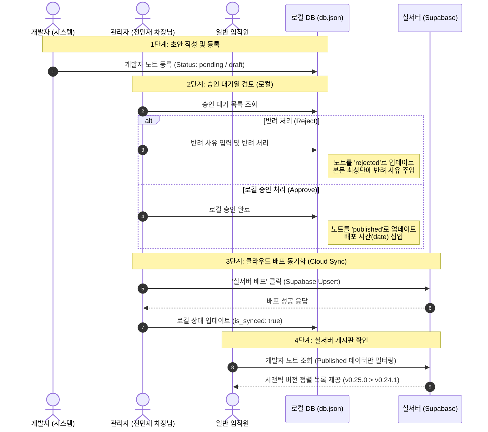

# 📝 개발자 노트 로직 흐름 보고서 (사용자 관점_R0)

* **작성일**: 2026-06-04
* **작성자**: Antigravity
* **문서 구분**: 검토 보고서 (Report) / 리비전 R0

---

## 1. ⚙️ 핵심 아키텍처 및 하이브리드 로직 개요

QMS v2의 개발자 노트는 로컬 내부망의 검증 환경과 외부 클라우드 실서버의 보안 이중화를 실현하기 위해 **하이브리드 데이터 로드 시스템**을 적용하고 있습니다.

* **로컬 개발 환경 (`import.meta.env.DEV` 참)**: 내부망 로컬 DB(JSON Server, 포트 3001)의 `dev_notes` 자원을 페치합니다.
* **실서버 프로덕션 환경 (`import.meta.env.DEV` 거짓)**: 클라우드 Supabase DB의 `dev_notes` 자원을 직접 페치하여 직원들이 바로 확인할 수 있게 합니다.

---

## 2. 🗺️ 사용자 관점 4단계 프로세스 흐름도 (Mermaid)

---

## 3. 👥 역할군별 사용자 경험 (UX) 상세 분석

### 👨‍💻 1) 시스템 개발자 관점 (작성 및 피드백 루프)
1. **패치노트 등록**: 개발자가 신규 버전을 릴리즈한 후 버전명(`version`), 업데이트 내용(`title`, `content`), 담당자명(`author`)을 입력해 시스템에 등록합니다.
2. **초안(Draft/Pending) 상태 유지**: 최초 등록 단계에서는 일반 사용자에게 노출되지 않으며, 오직 관리자(차장님) 승인 대기열에만 표시됩니다.
3. **반려 피드백 접수**: 승인이 반려될 경우, 노트는 `rejected` 상태로 변경되며 본문 최상단에 `### 🚫 반려됨 - 재작업 필요 (사유: ...)` 마크다운 안내가 자동 삽입되어 즉시 원인 분석 및 재수정이 가능합니다.

### 👑 2) 관리자 (전민재 차장님) 관점 (통제 및 배포 권한)
> [!IMPORTANT]
> **로컬 인트라넷 접속 강제 규칙**
> 보안상의 이유로 승인(`handleApprove`) 및 클라우드 배포(`handleCloudSync`) 액션은 **로컬 개발환경(localhost)**에서만 동작하도록 락(Lock)이 걸려 있습니다. 실서버 환경에서 시도 시 경고 얼럿이 발생합니다.

* **승인 대기열 검토 (`PostApproval`)**:
  * **[⏳ 승인 대기열]** 탭에서 미승인 건수(`pending`, `draft`, `rejected`)를 모니터링하고 본문을 상세 열람할 수 있습니다.
  * **[승인]** 버튼을 누르면 상태가 `published`로 변하며 로컬 인트라넷 게시판에 선공개됩니다.
* **실서버 최종 배포 (Cloud Sync)**:
  * **[🚀 배포 관리]** 탭에서 로컬 승인이 완료된 목록을 확인합니다.
  * **[실서버 배포]** 버튼을 누르면 Supabase 클라이언트를 통해 클라우드 DB에 데이터가 이식(`upsert`)됩니다. (동일 제목 충돌 시 덮어쓰기 방지 처리)
  * 성공적으로 이식 완료 시 로컬 DB의 해당 데이터에 `is_synced: true` 마크가 기록되어 중복 배포 실수를 방지합니다.

### 👥 3) 일반 임직원 관점 (시맨틱 버전 기반 열람)
* **정렬 로직 (`compareVersions`)**:
  * 사용자가 게시판(`DevNotes`)에 접속하면 지저분한 초안을 제외하고 오직 차장님이 최종 승인한 **`published`** 글만 표시됩니다.
  * 버전 정렬 함수가 작동하여 문자열 정렬 오류(예: v0.9가 v0.10보다 높게 나오는 현상)를 방지하고, **메이저 -> 마이너 -> 패치** 순으로 명확한 수학적 내림차순(최신 버전이 맨 위) 정렬을 보장합니다.
  * 검색 바를 통해 버전명(예: `v0.25.0`) 또는 제목 내용으로 빠르게 필터링하여 원하는 패치노트를 상세 모달 창으로 확인할 수 있습니다.

---

## 4. 📝 관련 소스코드 이정표
* **화면 및 정렬 뷰**: [DevNotes.jsx](file:///c:/Users/mjjeon/Desktop/QMS 프로젝트/shinwoo-valve-qms/src/components/DevNotes.jsx)
* **승인 및 클라우드 배포 백오피스**: [PostApproval.jsx](file:///c:/Users/mjjeon/Desktop/QMS 프로젝트/shinwoo-valve-qms/src/components/PostApproval.jsx)
