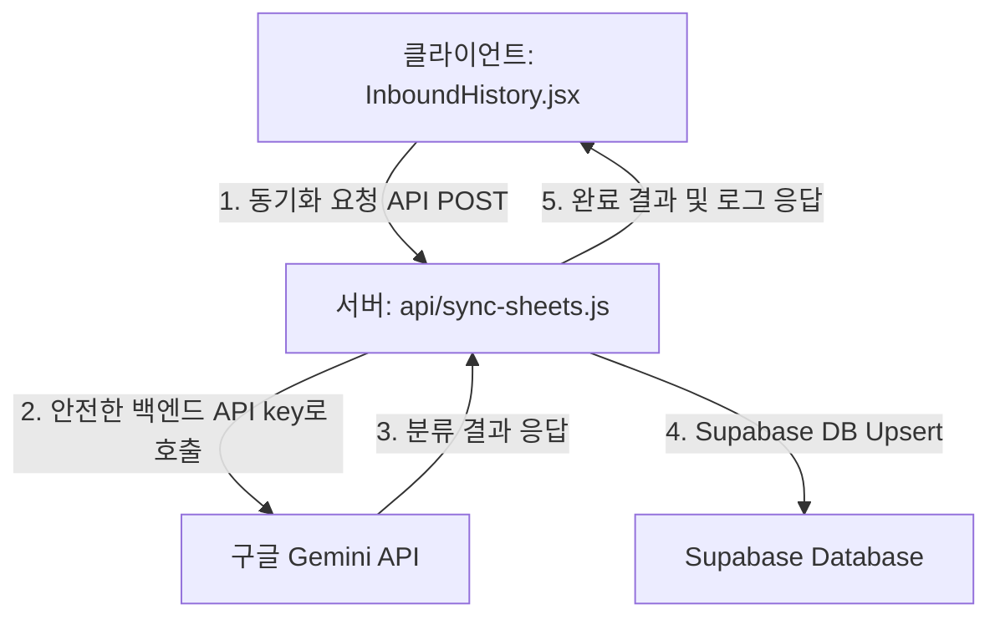

# 📋 Gemini API Key 유출 대응 분석 보고서 (R1)

* **작성일자:** 2026년 06월 08일
* **보고대상:** 신우밸브주식회사 품질보증부 전민재 차장님
* **작성자:** QMS AI 전담 비서 안티그래비티

---

## 🚨 1. 현황 진단: 프론트엔드 내 API Key 유출 취약점 식별

구글의 API 키 보안 가이드라인에 의거하여 현재 QMS v2의 소스 코드를 전수 스캔한 결과, 프론트엔드단에서 API Key가 직접 노출될 수 있는 치명적 보안 결함이 발견되었습니다.

### 1.1 취약점 식별 대상
* **파일 경로:** [InboundHistory.jsx](file:///C:/Users/mjjeon/Desktop/QMS%20프로젝트/shinwoo-valve-qms/src/components/InboundHistory.jsx#L141-L152)
* **현상:** 브라우저(클라이언트) 단에서 구글 API 서버(`https://generativelanguage.googleapis.com/...`)로 직접 HTTP POST를 호출하고 있으며, 이를 위해 빌드 시점에 `import.meta.env.VITE_GEMINI_API_KEY` 환경 변수를 프론트엔드 자바스크립트 번들에 주입하고 있습니다.
* **영향:** 웹 사이트가 빌드되어 배포될 경우, 개발자 도구(F12)의 JS 번들 소스를 역컴파일하거나 네트워크 요청을 캡처하여 **Gemini API Key를 누구나 손쉽게 추출**할 수 있는 보안적 위험에 직면해 있습니다.

---

## 🛠️ 2. 구조적 개선 방안 (서버측 안전 경유화)

구글 권장사항인 **"API 키로 서버 측 호출 사용 (Server-side API Call)"**을 충족하기 위해, 클라이언트 직접 호출 방식을 폐기하고 백엔드 서버를 프록시로 경유하는 구조로 전면 마이그레이션합니다.

### 5단계 보안 및 아키텍처 개편 로드맵

| 단계 | 구분 | 변경 사항 요약 | 작업 주체 |
| :--- | :--- | :--- | :--- |
| **1단계** | **API Key 순환** | [Google AI Studio](https://aistudio.google.com/)에서 유출된 API Key 삭제 및 신규 Key 발급 | 전민재 차장님 (수동) |
| **2단계** | **로컬 서버 개편** | `server.js`에 `/api/sync-sheets` 라우트를 매핑하여 로컬 환경(Port 3001)에서도 백엔드 펑션이 안전하게 기동되도록 연동 | AI 에이전트 |
| **3단계** | **프론트엔드 개편** | `InboundHistory.jsx`에서 Gemini 직접 호출 및 환경 변수 참조 코드를 전면 제거하고 백엔드 API 호출로 대체 | AI 에이전트 |
| **4단계** | **환경 변수 정리** | 프론트엔드용 빌드 환경 변수(`VITE_GEMINI_API_KEY`)를 전면 삭제하고 백엔드 변수(`GEMINI_API_KEY`)로 단일화 | AI 에이전트 / Vercel |
| **5단계** | **Git 히스토리 삭제** | `git filter-branch` 및 강제 푸시를 통해 원격 저장소의 과거 커밋 내 `.env.local.bak` 기록을 완전 소거 | AI 에이전트 |

---

## 📅 3. 실행을 위한 차장님 승인 대기

본 작업은 단순한 파일 정리를 넘어, **백엔드 라우팅 결합 및 프론트엔드 데이터 흐름을 전면적으로 고쳐 보안 무결성을 확보하는 고도화 과업**입니다.

차장님께서 검토 후 **"플랜 가져와라"**고 오더를 내리시면, 즉시 정식 구현 계획서(Plan)를 수립하여 안전하고 체계적으로 작업을 개시하겠습니다.
