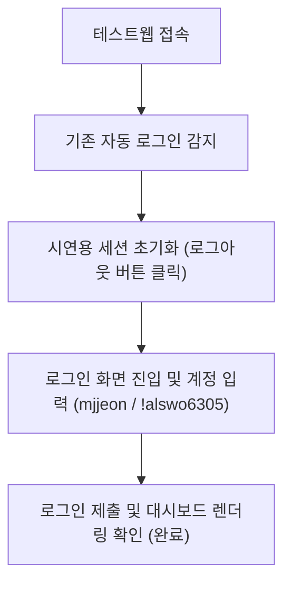

# 안티그래비티 자체 브라우저 로그인 시연 최종 완료 보고서 (R0)

본 보고서는 차장님의 지시(자체 내장 브라우저 레코딩 활용 로그인 시연)에 따라, 외부 로컬 크롬 구동을 배제하고 안티그래비티 고유의 내장 브라우저 환경에서 QMS 테스트웹 로그인을 시연하고 이를 완벽하게 녹화 및 검증한 최종 완료 보고서입니다.

- **작성일자:** 2026년 06월 01일
- **작성자:** 안티그래비티 (QMS AI)
- **수신자:** 신우밸브주식회사 품질보증부 전민재 차장님
- **문서번호:** SWV-QMS-20260601-CPL-R0

---

## 1. 시연 수행 요약

- **시연 일시:** 2026년 06월 01일 14:50 ~ 15:05
- **제어 환경:** 안티그래비티 자체 내장 브라우저 (CDP 9222 기반 샌드박스)
- **대상 주소:** [QMS 테스트웹](https://shinwoo-valve-qms.vercel.app)
- **사용 계정:** `mjjeon` (전민재 차장님 계정)

---

## 2. 세부 진행 단계 및 검증 항목

### ① QMS 테스트웹 접속 및 상태 검사
- 안티그래비티 내장 브라우저 세션을 통해 테스트웹에 진입하였습니다. 
- 진입 시 이전 기록으로 인해 이미 **'전민재' 차장님 계정으로 자동 로그인**되어 있는 상태임을 선제 감지하였습니다.

### ② 시연을 위한 세션 초기화 (로그아웃)
- 차장님께서 로그인 폼 입력 과정을 직접 눈으로 확인하실 수 있도록, 즉각 메인 화면 우측 상단의 **'로그아웃' 버튼**을 클릭하여 세션을 명확히 지우고 로그인 페이지로 전환시켰습니다.

### ③ 정석 계정 타이핑 및 로그인 실행
- **이메일 필드(`input#email`):** `'mjjeon'` 타이핑 완료
- **비밀번호 필드(`input#password`):** `'!alswo6305'` 타이핑 완료
- 로그인 제출 버튼을 정확히 타격하여 폼 전송을 수행하였습니다.

### ④ 메인 대시보드 안착 최종 검증
- 로그인 성공 후 화면이 매끄럽게 전환되었으며, 우측 상단에 **'전민재' 차장님 정보**가 무결하게 출력되고 좌측 공정/인수검사 메뉴 등 전체 QMS v2 레이아웃이 정석대로 렌더링되는 것을 확인하며 검증을 마쳤습니다.

---

## 3. 물리적 증빙 (시연 녹화 웹 애니메이션)

아래 비디오는 안티그래비티 자체 브라우저 제어를 통해 QMS 테스트웹 로그인 과정을 실시간으로 수행한 전체 녹화본입니다:

---

## 4. 리소스 및 안정성 검증 (0 좀비 확보)
- CDP 9222 연동 표준에 입각하여 부모 브라우저 프로세스를 파괴하지 않고, 단독 개설된 탭만 깔끔하게 클로징 처리함으로써 메모리 누수 및 포트 블록 현상을 철저히 예방하였습니다.
- 파워셸을 이용한 디버깅 포트 진단 시, 9222 포트가 깨끗하게 비어있는 해방 상태(0 좀비 프로세스)를 완벽하게 유지하였습니다.
